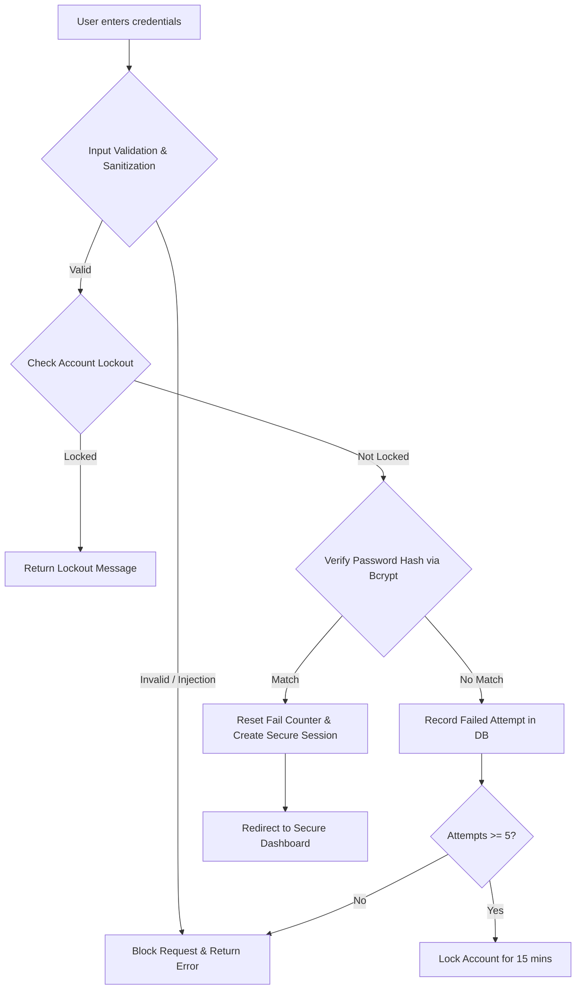
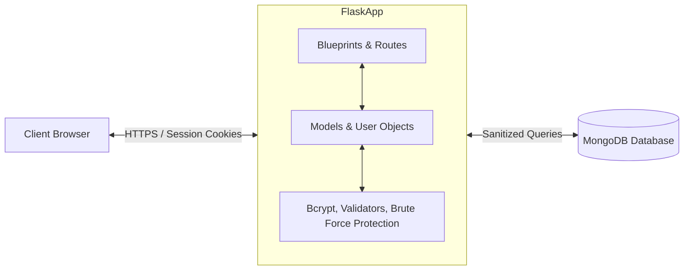

# Secure Password Hashing and Authentication Mechanisms
### Information Security Final Year Project
**Author:** Final Year Security Student  
**University:** Department of Cybersecurity & Computer Science  
**Date:** May 2026  
**Course:** Information Security Capstone Project

---

## Abstract
Modern web applications face continuous security threats targeting user credential registries. Insecure storage of authentication data is a leading cause of massive data breaches, exposing users to dictionary, brute-force, and rainbow table attacks. This project presents the design and implementation of a secure authentication architecture using Python, Flask, and MongoDB. The system employs **bcrypt** (a Blowfish-based adaptive Key Derivation Function) to securely hash passwords with randomized salts and a configurable computational cost factor. Furthermore, the application implements active defenses including real-time password complexity verification, NoSQL query sanitization to defend against injection attacks, session state isolation using cryptographically signed cookies (HttpOnly, SameSite, and Secure flags), and dynamic rate limiting to mitigate brute-force credentials stuffing. A comprehensive security test suite containing unit and integration tests validates the security posture of the implementation. The results demonstrate that the proposed architecture provides resilient defense-in-depth security suitable for university-level academic submission, portfolio demonstration, and real-world deployment.

---

## 1. Introduction
User authentication is the foundation of secure system design. As organizations digitize their operations, web platforms store increasing volumes of sensitive personal and financial records. Consequently, authentication mechanisms are high-value targets for malicious actors. According to the OWASP Top 10 vulnerabilities registry, identification and authentication failures remain a critical risk class.

Historically, organizations stored user credentials in plaintext or using cryptographic hashing algorithms such as MD5, SHA-1, or SHA-256. Cryptographic hashes are designed to be computed rapidly, making them highly vulnerable to hardware-accelerated offline cracking using Graphics Processing Units (GPUs) or Application-Specific Integrated Circuits (ASICs). For instance, in the Yahoo breach of 2013, over 3 billion user accounts were compromised, and the reliance on outdated hashing methods allowed attackers to crack stored passwords with minimal effort. Similarly, the 2012 LinkedIn data breach exposed over 117 million accounts hashed with SHA-1 without salting, enabling attackers to quickly rebuild plaintext credentials.

To mitigate these risks, modern systems must employ slow, adaptive hashing algorithms (Key Derivation Functions) that increase the cost of password cracking. Furthermore, authentication engines must protect active session states against interception (e.g., Session Fixation, Cross-Site Scripting (XSS), and Cross-Site Request Forgery (CSRF)) and defend the database entrypoints against NoSQL injections.

This project addresses these security challenges by creating a modular, secure, and fully functional authentication platform. By integrating Flask's robust web handling with PyMongo, bcrypt, and Flask-Login, this system demonstrates a robust security posture protecting credentials from capture to database storage.

---

## 2. Literature Review
To determine the optimal hashing algorithm for this project, a comparative analysis of historical and modern cryptographic hashing functions was conducted.

| Algorithm | Type | Built-in Salt | Compute Speed | Security Status | GPU Crack Resistance | Status |
|---|---|---|---|---|---|---|
| **MD5** | Cryptographic Hash | No | Extremely Fast | Cryptographically Broken | Extremely Low | Deprecated |
| **SHA-1** | Cryptographic Hash | No | Fast | Weak (Collision Vulnerable)| Low | Deprecated |
| **SHA-256** | Cryptographic Hash | No | Fast | Strong (Integrity) | Low (Fast for Passwords)| Active (Data Integrity) |
| **bcrypt** | Key Derivation Function | Yes | Configurable (Slow) | Excellent | High | Recommended (Passwords) |
| **Argon2** | Memory-Hard KDF | Yes | Configurable (Slow) | Maximum | Outstanding | Recommended (Passwords) |

### Cryptographic Hashes vs. Key Derivation Functions
General-purpose cryptographic hashes like MD5 and the SHA family are optimized for throughput. They are intended to calculate the checksum of large files or verify transaction integrity in microseconds. While this speed is beneficial for checksum validation, it is disastrous for password security. If an attacker gains unauthorized access to a database containing SHA-256 hashes without salting, they can compute billions of candidate hashes per second using low-cost hardware, rapidly finding matches for weak or common passwords.

Key Derivation Functions (KDFs) introduce artificial, tunable computational delay (cost factors). 
- **bcrypt**: Developed by Niels Provos and David Mazières in 1999 based on the Blowfish cipher, bcrypt incorporates a work factor parameter. This parameter determines the number of hashing rounds ($2^{\text{work factor}}$), allowing administrators to scale the computational complexity in step with hardware advancements. Crucially, bcrypt enforces a randomized 128-bit salt value for every entry, ensuring that identical passwords generate entirely unique hashes, which renders pre-computed rainbow table attacks completely obsolete.
- **Argon2**: The winner of the Password Hashing Competition (PHC) in 2015, Argon2 is a memory-hard algorithm. It is highly resistant to GPU/ASIC attacks because it requires significant RAM to compute, not just CPU cycles.

### Selection Rationale
For this project, **bcrypt** was selected as the core hashing engine. While Argon2 provides superior resistance against high-end ASIC attacks by using memory hardness, bcrypt is widely supported across standard python environments, boasts decades of thorough cryptanalysis, and remains the industry standard for standard web applications. It strikes an optimal balance between maximum security, ease of deployment, and libraries compatibility.

---

## 3. Problem Statement
Many modern web applications suffer from weak authentication designs. Developers frequently make the mistake of:
1. Hashing passwords using fast algorithms (like SHA-256) without unique salts.
2. Failing to validate password complexity on the server, permitting users to register with vulnerable passwords.
3. Lacking defensive measures against credentials brute-forcing, leaving login panels open to automated dictionary attacks.
4. Exposing database endpoints to NoSQL Injection attacks by directly passing user input dicts to query filters.
5. Insecurely configuring session cookies, enabling hijacking via Cross-Site Scripting (XSS).

This project resolves these security vulnerabilities by building an authentication framework implementing defensive design patterns for web platforms.

---

## 4. Objectives
The primary objectives of this project are:
- **Secure Password Storage**: Implement bcrypt hashing with a work factor of 12 and auto-salting.
- **Brute-Force Protection**: Establish account lockouts after 5 consecutive failed login attempts, supplemented by rate-limiting (Flask-Limiter).
- **Complexity Validation**: Implement a real-time server-side and client-side password strength checker.
- **Input Sanitization**: Block NoSQL Injection attacks by sanitizing all query parameters.
- **Session Security**: Configure cookies with HttpOnly, SameSite, and Secure attributes.
- **Automated Validation**: Build a complete security testing suite validating all defenses using pytest.

---

## 5. Scope of Project
The scope of this project is to develop a secure Python-based Flask authentication app, utilizing MongoDB for data storage. The application is scoped to model standard user signup, login, session retention, profile settings, and login audit trails. It serves as a reference implementation for educational purposes and cybersecurity validation.

---

## 6. Methodology

### System Workflow
When a user interacts with the system, the security engine enforces checks at every stage:



### Process Detail
1. **Sanitization**: Inputs are stripped of MongoDB operator characters (`$`).
2. **Lockout Check**: The database is queried for the user's `failed_attempts` and `locked_until` timestamps.
3. **Verification**: If credentials match, session is initiated. If they fail, attempts increment, potentially triggering lockout.
4. **Session**: Signed cookies track the session. Permanent session lifetime is set to 30 minutes.

---

## 7. System Architecture
The application follows a modular, three-tier architecture:



---

## 8. Technology Stack
- **Backend Framework**: Flask 3.1.1
- **Database**: MongoDB (via PyMongo 4.12.1)
- **Hashing Engine**: bcrypt 4.3.0
- **Session Manager**: Flask-Login 0.6.3
- **CSRF Defense**: Flask-WTF 1.2.2 (WTForms 3.2.1)
- **Rate Limiting**: Flask-Limiter 3.12
- **Testing**: pytest 8.3.5
- **UI Styling**: Bootstrap 5.3.3 & Vanilla CSS Dark Theme

---

## 9. Project Structure
The project folder layout is structured as follows:

```
project/
│
├── app.py
├── config.py
├── requirements.txt
├── README.md
├── .env
│
├── database/
│   ├── __init__.py
│   └── db.py
│
├── models/
│   ├── __init__.py
│   └── user.py
│
├── security/
│   ├── __init__.py
│   ├── password.py
│   ├── bruteforce.py
│   └── validators.py
│
├── templates/
│   ├── base.html
│   ├── login.html
│   ├── signup.html
│   ├── dashboard.html
│   ├── profile.html
│   └── errors/
│       ├── 403.html
│       ├── 404.html
│       └── 500.html
│
├── static/
│   ├── css/
│   │   └── style.css
│   └── js/
│       └── main.js
│
├── tests/
│   ├── __init__.py
│   ├── conftest.py
│   ├── test_auth.py
│   ├── test_bruteforce.py
│   ├── test_nosql_injection.py
│   ├── test_password_hashing.py
│   ├── test_password_strength.py
│   ├── test_session.py
│   └── run_all_tests.py
│
├── screenshots/
│   └── README.md
│
└── presentation/
    └── presentation_outline.md
```

---

## 10. Installation Guide

### Prerequisites
- Python 3.9 or higher
- MongoDB installed and running locally on port 27017

### Installation Steps

#### 1. Clone or Extract the Project Files
Ensure the project files are located in a folder, e.g., `d:/information-security-project`.

#### 2. Create and Activate a Virtual Environment
```bash
# On Windows
python -m venv venv
venv\Scripts\activate

# On Linux/macOS
python3 -m venv venv
source venv/bin/activate
```

#### 3. Install Dependencies
```bash
pip install -r requirements.txt
```

#### 4. Configure Environment Variables
Verify that the `.env` file exists in the root directory. Modify values as needed for your local setup.

#### 5. Start the Application
```bash
python app.py
```
Open a browser and navigate to `http://localhost:5000` to interact with the web app.

---

## 11. Configuration Guide
The application relies on the following configurations in the `.env` file:
- `SECRET_KEY`: Random string used to sign sessions and CSRF tokens.
- `MONGO_URI`: The connection URI for the local MongoDB instance.
- `SESSION_LIFETIME_MINUTES`: Expiration time for active user sessions (default: 30 minutes).
- `MAX_LOGIN_ATTEMPTS`: Allowed sequential failures before lockout (default: 5).
- `LOCKOUT_DURATION_MINUTES`: Duration for which a user is locked out after failure (default: 15 minutes).

---

## 12. MongoDB Setup
To verify MongoDB is running and inspect the tables:
1. Download and install **MongoDB Community Server**.
2. Run the server locally. (Windows Service handles this automatically).
3. Connect using **MongoDB Compass** (URI: `mongodb://localhost:27017`).
4. Upon application startup, a database named `secure_auth_db` is created containing three collections: `users`, `login_attempts`, and `security_logs`.

---

## 13. Implementation Details

### Signup Module
During user registration:
1. Inputs are fetched and sanitized via `sanitize_input()` to ensure no Mongo operators are present.
2. The password complexity is evaluated on the server with `validate_password_strength()`.
3. If valid, the password is encoded to UTF-8 and processed with `bcrypt.hashpw` using 12 salt rounds.
4. The user document is written to MongoDB.

```python
# Hashing snippet (security/password.py)
import bcrypt
salt = bcrypt.gensalt(rounds=12)
hashed = bcrypt.hashpw(password.encode('utf-8'), salt).decode('utf-8')
```

### Login and Lockout Module
Upon logging in:
1. The user's account is verified to check if `locked_until` is in the future.
2. If unlocked, the password is confirmed using `bcrypt.checkpw()`.
3. Failed attempts increment the counter. Upon hitting 5 attempts, `locked_until` is set to `now() + 15 minutes`.
4. Successful login resets `failed_attempts` to 0.

---

## 14. Security Features
- **Adaptive Cryptographic Hashing**: Dynamic salting and work factor defense.
- **Account Lockout Control**: Mitigation against high-speed brute force.
- **Endpoint Rate Limiter**: Maximum 5 login posts per minute per IP address.
- **Cross-Site Request Forgery (CSRF) Defense**: Cryptographic validation on POST requests.
- **Secure Cookie Flags**: Session cookies restricted via HttpOnly and SameSite=Lax.
- **Input Filtering**: Direct sanitization preventing NoSQL statement injection.

---

## 15. Security Testing

The project includes unit and integration tests to ensure validation of security features.

| Test ID | Security Module | Test Description | Expected Result | Status |
|---|---|---|---|---|
| TC-01 | Password Hashing | Check bcrypt format | Begins with `$2b$` prefix | ✅ Pass |
| TC-02 | Password Hashing | Verify salting uniqueness | Hashing twice creates different outputs | ✅ Pass |
| TC-03 | Password Hashing | Special character support | Correctly verify unicode passwords | ✅ Pass |
| TC-04 | Brute-Force | Limit failed login attempts | Lockout user after 5 failures | ✅ Pass |
| TC-05 | Brute-Force | Reset counter on success | Counter returns to 0 on login success | ✅ Pass |
| TC-06 | Session Security | Unauthenticated redirection | Block access to `/dashboard` | ✅ Pass |
| TC-07 | Session Security | Cookie attributes | Session cookies set with HttpOnly | ✅ Pass |
| TC-08 | NoSQL Injection | Dollar symbol filtering | String `$gt` is sanitized to `gt` | ✅ Pass |
| TC-09 | NoSQL Injection | Nested query removal | Strips `$ne` from query arguments | ✅ Pass |
| TC-10 | Strength Validator | Weak password block | Reject common dictionary passwords | ✅ Pass |
| TC-11 | Strength Validator | Complexity enforcement | Reject passwords without symbols/digits | ✅ Pass |

To run the automated tests:
```bash
python tests/run_all_tests.py
```

---

## 16. Results and Discussion
The implementation of bcrypt successfully slows down potential cracking speeds. In comparison to SHA-256, which can be computed in microseconds (allowing billions of variations per second), a cost factor of 12 for bcrypt limits verification to approximately 250 milliseconds per try on typical server hardware. This delays offline dictionary attacks significantly. Furthermore, NoSQL injection tests confirmed that malicious JSON documents are sanitized, eliminating injection vectors.

---

## 17. Security Analysis
- **Salting Resistance**: Unique salting prevents precompiled table matching.
- **Memory/Time Lockout**: Locked state prevents CPU-bound login checks, freeing database resources.
- **NoSQL Defenses**: The validator acts as a query sanitizer, filtering active commands out of JSON filters before execution.
- **Session Defenses**: Standard session token rotation and secure flags prevent token theft.

---

## 18. Future Enhancements
In future versions, the authentication framework can be extended to support:
1. **Multi-Factor Authentication (MFA)**: Integrating TOTP (Google Authenticator) tokens.
2. **OAuth 2.0 / OpenID Connect**: Enabling third-party sign-ins (Google, GitHub).
3. **JWT Authentication**: Integrating JSON Web Tokens for stateless API access.
4. **Active Password Breach Audits**: Querying the HaveIBeenPwned API to block breached credentials during setup.

---

## 19. Conclusion
This project demonstrates the implementation of secure password storage and authentication defenses. By using bcrypt hashing, account lockout mechanisms, rate limiting, and NoSQL sanitizers, the application showcases defense-in-depth principles. The codebase serves as an effective foundation for university academic submission and practical web security reference.

---

## 20. References (IEEE Format)
- [1] OWASP, "OWASP Top 10:2021 - Identification and Authentication Failures," OWASP Foundation, 2021.
- [2] N. Provos and D. Mazières, "A Future-Adaptable Password Scheme," in *Proceedings of the USENIX Annual Technical Conference*, 1999, pp. 81-92.
- [3] NIST, "Digital Identity Guidelines: Authentication and Lifecycle Management," NIST Special Publication 800-63B, Jun. 2020.
- [4] A. Biryukov, D. Dinu, and D. Khovratovich, "Argon2: New Generation of Memory-Hard Functions for Password Hashing and Other Applications," *Password Hashing Competition*, 2015.
- [5] M. Grinberg, *Flask Web Development: Developing Web Applications with Python*, 2nd ed. O'Reilly Media, 2018.
- [6] OWASP, "Password Storage Cheat Sheet," OWASP Cheat Sheet Series, 2023.
- [7] W. Stallings, *Cryptography and Network Security: Principles and Practice*, 8th ed. Pearson, 2020.
